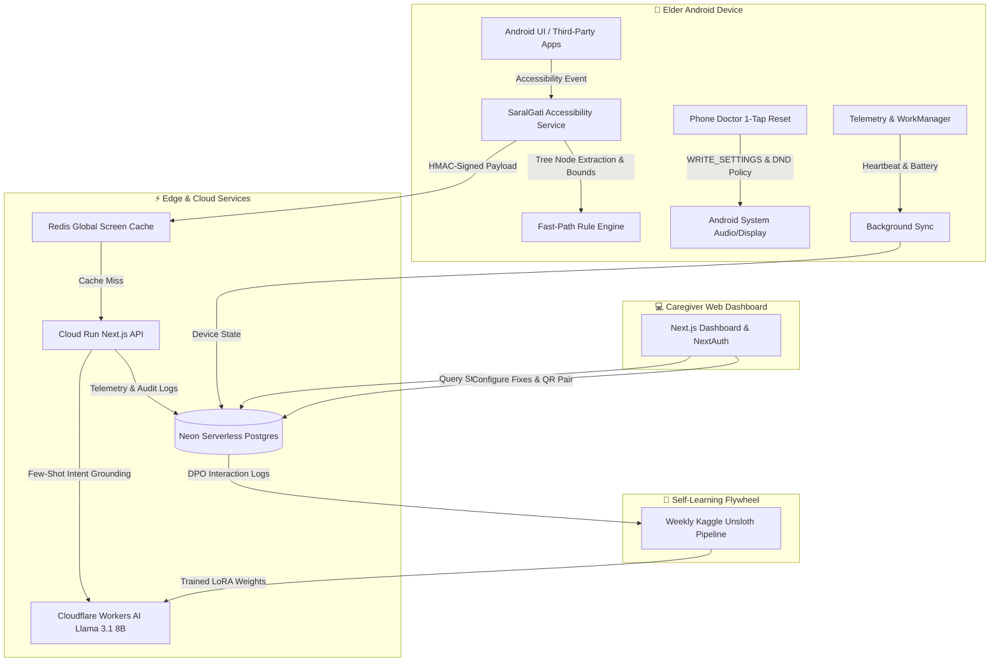

# 🌸 SaralGati (सरल गति)

### _AI-Powered Digital Companion & Guardian for Elders_

[](https://github.com/ShunyaPulse/SaralGati/actions/workflows/build-apk.yml)
[](https://github.com/ShunyaPulse/SaralGati/actions/workflows/deploy.yml)
[](https://github.com/ShunyaPulse/SaralGati/actions/workflows/codeql.yml)
[](LICENSE)
[](https://github.com/ShunyaPulse/SaralGati)

> **"Technology should adapt to our parents, not the other way around."**  
> SaralGati is an autonomous, on-device AI companion and remote caregiver ecosystem engineered to give senior citizens in India complete digital independence. It guides elders step-by-step through any smartphone app using natural voice and visual spotlights, while giving family caregivers remote peace of mind.

---

## 📖 Table of Contents

1. [The Challenge: Digital Exclusion Among Seniors](#-the-challenge-digital-exclusion-among-seniors)
2. [What is SaralGati?](#-what-is-saralgati)
3. [Key Features for Elders & Caregivers (70%)](#-key-features-for-elders--caregivers)
   - [Live Floating Companion ("Saral Mitra")](#1-live-floating-companion-saral-mitra)
   - [Visual Focus Spotlight](#2-visual-focus-spotlight)
   - [Hands-Free Multi-Step Flow Engine](#3-hands-free-multi-step-flow-engine)
   - [Phone Doctor ("Sab Theek Karo" 1-Tap Reset)](#4-phone-doctor-sab-theek-karo-1-tap-reset)
   - [Caregiver Command Dashboard](#5-caregiver-command-dashboard)
   - [Strict Privacy-First Commitment](#6-strict-privacy-first-commitment)
4. [Architecture, Technology & Security (30%)](#-architecture-technology--security)
   - [System Architecture Diagram](#system-architecture-diagram)
   - [Native Android Companion App Stack](#native-android-companion-app-stack)
   - [Cloud & Backend Infrastructure](#cloud--backend-infrastructure)
   - [Edge AI & Autonomous Flywheel](#edge-ai--autonomous-flywheel)
   - [Security & Reliability Hardening](#security--reliability-hardening)
5. [Getting Started & Installation](#-getting-started--installation)
6. [Release & In-App Auto Update](#-release--in-app-auto-update)

---

## 👵 The Challenge: Digital Exclusion Among Seniors

Over 140 million elders in India have smartphones, yet the vast majority feel anxious and dependent on their children for basic tasks:

- **Frequent UI Redesigns**: Everyday apps like WhatsApp, PhonePe, and YouTube change layouts often, confusing seniors.
- **Language & Tech Jargon**: Prompts in English with words like _"Authenticate"_, _"Permissions"_, or _"Sync"_ cause fear of doing something wrong.
- **Accidental Settings Misconfigurations**: Sound accidentally silenced, screen brightness dimmed, Do Not Disturb turned on, or screen timeout set to 15 seconds.
- **Fear of Cyber Scams**: Constant fear of clicking the wrong button or falling victim to fraudulent requests.
- **Hesitation to Ask**: Elders often feel guilty repeatedly asking their busy children for help with phone problems.

---

## 🌟 What is SaralGati?

**SaralGati ("सरल गति" – Effortless Movement)** transforms an ordinary Android smartphone into an elder-friendly, guided device without dumbing down the phone or replacing the OS:

1. **The Senior** uses their phone naturally. Whenever stuck, a single tap on the friendly floating helper explains what to do in soothing Hindi/Hinglish, illuminating the exact button with a bright spotlight ring.
2. **The Caregiver (Son / Daughter)** gets a clean web dashboard to remotely pair their parent's phone via QR code, monitor battery levels and connectivity, configure 1-tap phone healing parameters, and see that their loved ones are safe.

---

## 💡 Key Features for Elders & Caregivers

### 1. Live Floating Companion ("Saral Mitra")

- **Always Available**: A gentle, unobtrusive floating button rests at the screen edge across all third-party apps.
- **Instant Spoken Assistance**: Speaks patient Hindi audio instructions (e.g., _"Suresh beta ko message bhejne ke liye niche chat par tap karein"_).
- **Rage-Tap & Confusion Detection**: Detects if an elder repeatedly taps an unresponsive area or hesitates, proactively popping up to ask: _"Kya madad chahiye?"_

### 2. Visual Focus Spotlight

- **Zero Distractions**: When guidance is requested, background elements softly dim and a glowing spotlight ring draws direct attention to the target button.
- **Smart Below-the-Fold Peeking**: If the required action button is hidden below the visible screen, SaralGati automatically peeks, scrolls smoothly, and points the elder in the right direction.

### 3. Hands-Free Multi-Step Flow Engine

- **Complex Tasks Made Simple**: Guides elders across multi-screen flows without interruption (e.g., _WhatsApp Video Call Flow_: `Chats Tab` ➔ `Search or Select Contact` ➔ `Chat Window` ➔ `Video Call Button`).
- **Auto-Advancing Sessions**: Recognizes when step 1 is completed and immediately transitions to step 2 with updated spoken guidance.

### 4. Phone Doctor ("Sab Theek Karo" 1-Tap Reset)

Elders frequently mess up phone settings by accident. Rather than navigating deep Android system menus, the **Phone Doctor** tab gives elders a single giant green button:

- 🔊 **Restores Ringer Volume**: Immediately unmutes the phone and sets incoming ringtone to maximum.
- 🎬 **Optimizes Media Volume**: Sets video and audio volume to an elder-comfortable 85%.
- ☀️ **Restores Screen Brightness**: Resets brightness to 85% for crystal-clear readability.
- ⏱️ **Extends Screen Timeout**: Sets display timeout to 5 minutes so the screen doesn't abruptly sleep while reading.
- 🔕 **Disables Do Not Disturb (DND)**: Silently turns off DND so family calls are never missed.
- _Caregiver Configurable_: Caregivers can selectively toggle which parameters are healed via a PIN-protected Caregiver settings panel.

### 5. Caregiver Command Dashboard

- **Zero-Friction QR Pairing**: Caregivers pair an elder's phone in seconds by scanning a secure pairing QR code from the dashboard.
- **Live Device Telemetry**: Shows real-time battery percentage, charging state, companion service heartbeat, and app version.
- **Frequent Contact & Habit Insights**: Aggregates frequent contacts (e.g., _"Doctor Sharma"_, _"Ramesh Bhaiya"_) so the companion understands family context without personal data leaks.

### 6. Strict Privacy-First Commitment

- ❌ **NO Screenshots Taken**: SaralGati never captures screenshots or screen recordings.
- ❌ **NO Personal Chats Read**: Personal message bodies, photo galleries, and payment PINs are completely inaccessible.
- ✅ **Accessibility Tree Only**: The app only reads interactive UI element roles (e.g., `[BUTTON] Send`, `[INPUT] Search`) solely to calculate coordinate targets.

---

## 🛠️ Architecture, Technology & Security

### System Architecture Diagram



### Native Android Companion App Stack

- **Language & Framework**: Kotlin, Jetpack Compose, Material 3 with high-contrast elder accessibility themes.
- **Accessibility Engine**: Custom `AccessibilityService` traversing `AccessibilityNodeInfo` hierarchy with DP-normalized boundaries, below-fold peek scrolling, and clickable `TextView` role resolution.
- **Persistent Reliability**:
  - `ForegroundService` with notification channel for 24/7 background survival.
  - Custom `AutoStartHelper` navigating brand-specific OEM battery killers (Xiaomi/MIUI, Samsung, Oppo, Vivo, OnePlus).
  - Battery optimization whitelist (`ACTION_REQUEST_IGNORE_BATTERY_OPTIMIZATIONS`).
- **Seamless In-App Updates**: Built with Android `PackageInstaller` session API. Bypasses Android 13+ _"Restricted Settings"_ lockouts by performing seamless updates directly inside the app session.
- **Production Hardening**: ProGuard / R8 bytecode obfuscation, unused resource shrinking, and permanent CI release keystore signing (`keystore.jks`).

### Cloud & Backend Infrastructure

- **Full-Stack Framework**: Next.js 16 (App Router, standalone output, React 19), TypeScript, Tailwind CSS.
- **Deployment**: Containerized on Google Cloud Run (`asia-south1`) with automated GitHub Actions GitOps.
- **Database Layer**: Neon Serverless PostgreSQL with connection pooling (`pg`), Drizzle/raw SQL, and automated schema migrations.
- **High-Speed Cache**: Oracle VM Redis running sub-5ms screen hash caches, interaction rate-limiting, and frequent habit caches.

### Edge AI & Autonomous Flywheel

- **Primary LLM**: Llama 3.1 8B Instruct deployed on Cloudflare Workers AI (`@cf/meta/llama-3.1-8b-instruct-fast`).
- **Custom LoRA Adapter**: Fine-tuned on Hinglish elder voice queries and Android UI graphs (`saralgati-elder-llama31-8b`).
- **Autonomous Feedback Flywheel**:
  - Tracks implicit user actions (`tapped_suggested` vs `tapped_other`).
  - Weekly scheduled GitHub Action trains DPO preference datasets on Kaggle Dual-T4 GPUs using Unsloth.
  - Automatically exports and deploys updated LoRA adapters to Cloudflare Workers AI with zero downtime.

### Security & Reliability Hardening

- **HMAC Request Integrity**: All requests from the Android companion are signed with HMAC-SHA256 timestamp hashes (`X-App-Signature`, `X-App-Timestamp`) with replay protection.
- **Cloudflare Turnstile**: Zero-friction anti-bot verification on caregiver registration and OTP login.
- **Zero Hardcoded Secrets Invariant**: Complete isolation of credentials across GitHub Actions Secrets, GCP Secret Manager, and git-ignored local environments.
- **Continuous Security Analysis**: CodeQL static analysis, Semgrep rulesets, Gitleaks secret scanning, and automated Dependabot updates running on every pull request.

---

## 🚀 Getting Started & Installation

### Android Companion App

1. Download the latest release APK from [GitHub Releases](https://github.com/ShunyaPulse/SaralGati/releases).
2. Install the APK on the elder's smartphone.
3. Grant **Accessibility Service** permission (`SaralGati Assistant`).
4. (Optional) For Phone Doctor audio/brightness fixes, grant _Modify System Settings_ and _Do Not Disturb Access_ when prompted in the Caregiver menu.
5. Scan the pairing QR code from the Caregiver Dashboard.

### Web Dashboard & Backend Setup

```bash
# Clone the repository
git clone https://github.com/ShunyaPulse/SaralGati.git
cd SaralGati

# Install dependencies
npm install --legacy-peer-deps

# Configure environment variables
cp .env.example .env.local
# Add your DATABASE_URL, REDIS_URL, NEXTAUTH_SECRET, etc.

# Run the development server
npm run dev
```

---

## 📦 Tech Stack Summary

| Layer              | Technologies                                                                       |
| :----------------- | :--------------------------------------------------------------------------------- |
| **Android App**    | Kotlin, Jetpack Compose, Material 3, AccessibilityService, WorkManager, Coroutines |
| **Web & API**      | Next.js 16, React, TypeScript, Tailwind CSS, NextAuth.js                           |
| **Cloud & DevOps** | Google Cloud Run, Docker, GitHub Actions, Cloudflare Workers AI                    |
| **Data & Cache**   | Neon Serverless PostgreSQL, Oracle Cloud Redis                                     |
| **AI / ML**        | Llama 3.1 8B Instruct, Unsloth, Kaggle Dual-T4, PEFT LoRA                          |
| **Security**       | HMAC-SHA256, Cloudflare Turnstile, R8/ProGuard, CodeQL, Gitleaks                   |

---

<p align="center">
  <i>Developed with ❤️ for Indian families by <a href="https://github.com/ShunyaPulse">Vansh Gupta (ShunyaPulse)</a></i>
</p>
